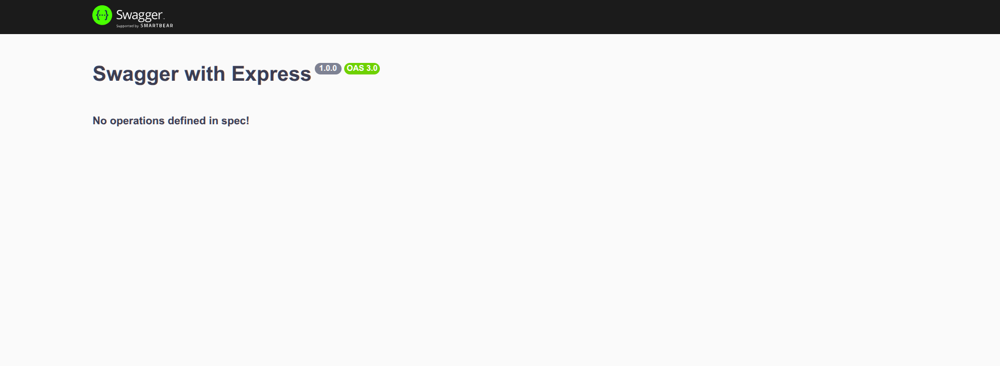
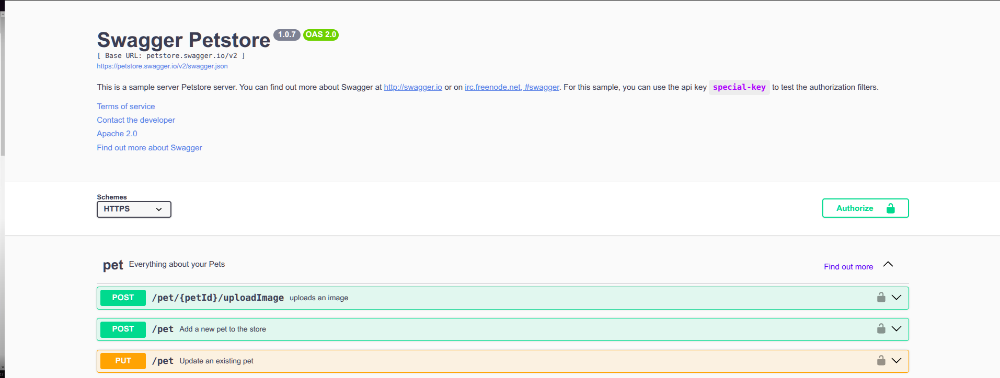
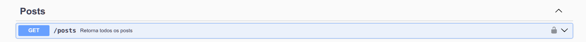

# Fazendo documentações de apis Express com Swagger

Baixe a biblioteca Swagger UI Express:

```
npm install swagger-ui-express
```

crie na raiz do projeto um arquivo chamado swwagger.json ou swwagger.yaml e coloque uma chave vazia em seu conteúdo:

```json
swagger.json
{}
```

Importe em server.js o swaggerUi:

```js
const express = require("express");
const app = express();

const swaggerUi = require("swagger-ui-express"); //commonjs
// ou
//import swaggerUi from "swagger-ui-express"; //ES6
```

Adicione o middleware do swagger:

```js
app.use("api-docs", swaggerUi.serve, swaggerUi.setup(require("./swagger")));

//Ou para melhor legibilidade:
// const swaggerDocs = require("./swagger.json");
// app.use("api-docs", swaggerUi.serve, swaggerUi.setup(swaggerDocs));
```

Visite _http://localhost:3000/api-docs/_ e vera algo proximo a isso:

<p align="center">
    
</p>

Como não temos nenhuma definição até o momento a documentação ainda não estará acessível, adicione agora o cabeçalho de nossa documentação acesse novamente http://localhost:3000/api-docs/:

```json
{
  "openapi": "3.0.0",
  "info": {
    "title": "Swagger with Express",
    "description": "Essa api tem como objetivo demonstra o uso do swagger com express",
    "version": "1.0.0"
  }
}
```

Vera algo proximo a isso:

<p align="center">
    
</p>

O swagger também possui uma documentação de test que pode ser acessada em https://petstore.swagger.io/ é assim que queremos que nossa documentação de api fique ao final do projeto

<p align="center">
    
</p>

Podemos também acessar o json utilizado para gerar essa documentação em https://petstore.swagger.io/v2/swagger.json

Agora vamos deixar essa cabeçalho um pouco mais completo, iremos adicionar uma rota de acesso aos termos de uso de nossa api que poderá ser disponibilizada através de uma pagina estática fornecida pelo servido ou uma rota a parte, também colocaremos um contato de referencia

```json
    "openapi": "3.0.0",
    "info": {
        "title": "Swagger with Express",
        "description": "Essa api tem como objetivo demonstra o uso do swagger com express",
        "version": "1.0.0",
        "termsOfService": "http://localhost:3000/terms/",
        "contact": {
            "name": "Davi Cândido",
            "email": "davicandidopucminas@gmail.com"
        }
    },
```

Em seguida vamos informar quais urls nossa Api estará disponibilizada

```json
    "servers": [{
        "url": "http://localhost:3000/v1",
        "description": "Ambiente de desenvolvimento"
     },{
        "url": "www.crudJourney.com/v2",
        "description": "Ambiente de produção"
     }
    ]
```

Agora iremos fazer um mapeamento de todas as rotas presente ou que futuramente estarão presentes em nossa api, vamos iniciar mapeando a rota de primeira rota de get:

```json
"paths": {
        "/posts":{
            "sumarry": "Retorna todos os posts",
            "description": "Essa rota será responsável por retorna todos os posts",
            "get": {
                "tags": ["Posts"],
                "responses": {
                    "200": {
                        "description": "Retorna todos os posts"
                    },
                    "404": {
                        "description": "Nenhum post foi encontrado"
                    }
                }
            }
        }
}
```

Para post teremos um tratamento um pouco diferente, teremos uma propriedade chamada _requestBody_ que será responsável por dizer o tipo de dado requerido, que no nosso caso é o application/json, que por sua vez conterá o schema, ou seja o esquema referente ao formato como esses dados devem ser enviados, com seus atributos e tipos, veja que o esquema e feito através de um componente que é referenciado através do _$ref_, o esquema em sí foi definido em "componentes":

```json
    "post": {
        "summary": "Cria um post",
        "description": "Essa rota cria um post",
        "tags": ["Posts"],
        "requestBody": {
          "content": {
            "application/json": {
              "schema": {
                "$ref": "#/components/schemas/Post"
              },
              "examples": {
                "post": {
                  "value": {
                    "title": "Post 1",
                    "content": "Conteudo do post 1"
                  }
                }
              }
            }
          }
        },
        "responses": {
          "201": {
            "description": "Post criado com sucesso"
          },
          "404": {
            "description": "Dados incorretos ou incompletos"
          }
        }
      }
    }
  },
  "components": {
    "schemas": {
      "Post": {
        "type": "object",
        "required": ["title", "content"],
        "properties": {
          "id": {
            "type": "number"
          },
          "title": {
            "type": "string"
          },
          "content": {
            "type": "string"
          }
        }
      }
    }
  }
```

Extra: Caso a api use varições de segurança como JWT, também se é precisos informá-la em nossa documentação, para isso criamos um campo de securitySchemes no mesmo nível do schema em componentes

```json
"components": {
    "schemas": {
      ...
    },
    "securitySchemes": {
      "bearerAuth": {
        "type": "http",
        "scheme": "bearer",
        "bearerFormat": "JWT"
      }
    }
  }
```

Agora nas rotas definidas adicione uma tag de security, no mesmo nivel do summary, description e tags, dessa forma:

```json
"paths": {
    "/posts": {
      "get": {
        "summary": "Retorna todos os posts",
        "description": "Essa rota será responsável por retorna todos os posts",
        "tags": ["Posts"],
        "security": [{
          "bearerAuth": []
        }], 
        ...
```

Acesse novamente nossa documentação em http://localhost:3000/api-docs/ e veja que temos agora um cadeado no canto direito de nossa rota get, informando que esta rota é um rota autenticada:

<p align="center">
    
</p>

Para rotas que exigem a passagem de parâmetros o query criamos uma rota no mesmo nivel da anterior rota defina como _/posts_, veja o exemplo:

```json
"paths": {
    "/posts": {
      "get": {
        ...
      },
      "post": {
        ...
      }
    },
    "/posts/{id}": {
      "get": {
        "summary": "Retorna um post",
        "description": "Essa rota será responsável por retornar um post pertencente ao id passado na rota",
        "tags": ["Posts"],
        "parameters": [
          {
            "name": "id",
            "in": "path",
            "required": true,
            "schema": {
              "type": "number"
            }
          }
        ],
        "security": [
          {
            "bearerAuth": []
          }
        ],
        "responses": {
          "200": {
            "description": "Retorna o post pertencente ao {id}",
            "content": {
              "application/json": {
                "schema": {
                  "type": "object",
                  "example": {
                      "id": 1,
                      "title": "Post 1",
                      "content": "Conteudo do post 1"
                  }
                }
              }
            }
          },
          "404": {
            "description": "Nenhum post foi encontrado"
          }
        }
      }
    }
```

Veja que agora na rota apresentada em nossa documentação sera criado um campo de teste onde poderemos adicionar um id de busca: 


<p align="center">
    
</p>

De forma semelhante agora podemos criar a documentação de nossas rotas de _PUT_ (atualização total) e _DELETE_, para a rota de _PUT_ segue o exemplo a baixo, veremos que nada mais do que se trata de uma adição de um _requestBody_ para informar os dados que serão enviados para atualização do post pertencente ao id informado em _parameters_, veja:


```json
"/posts/{id}": {
      "get": {
        ...
      },
      "put": {
        "summary": "Atualiza completamente um post de acordo com o id passado na rota",
        "description": "Essa rota será responsável por atualizar completamente um post de acordo com o id passado na rota",
        "tags": ["Posts"],
        "parameters": [{
            "name": "id",
            "in": "path",
            "required": true,
            "schema": {
              "type": "number"
            }
        }],
        "security": [{
            "bearerAuth": []
        }],
        "requestBody": {
          "content": {
            "application/json": {
              "schema": {
                "$ref": "#/components/schemas/Post"
              },
              "examples": {
                "post": {
                  "value": {
                    "title": "Post 1 atualizado",
                    "content": "Conteudo do post 1 atualizado"
                  }
                }
              }
            }
          }
        },
        "responses": {
          "200": {
            "description": "Retorna o post atualizado pertencente ao {id}",
            "content": {
              "application/json": {
                "schema": {
                  "type": "object",
                  "example": {
                    "message": "Post atualizado com sucesso",
                    "post": {
                      "id": 1,
                      "title": "Post 1 atualizado",
                      "content": "Conteudo do post 1 atualizado"
                    }
                  }
                }
              }
            }
          },
          "404": {
            "description": "Nenhum post foi encontrado"
          }
        }
      }
    }
```


E para a rota de delete, 

```json
    "/posts/{id}": {
      "get": {
        ...
      },
      "put": {
        ...
      },
      "delete": {
        "summary": "Deleta um post de acordo com o id passado na rota",
        "description": "Essa rota será responsável por deletar um post de acordo com o id passado na rota",
        "tags": ["Posts"],
        "parameters": [{
            "name": "id",
            "in": "path",
            "required": true,
            "schema": {
              "type": "number"
            }
        }],
        "security": [{
            "bearerAuth": []
        }],
        "responses": {
          "200": {
            "description": "Retorna o post pertencente ao {id} foi deletado",
            "content": {
              "application/json": {
                "schema": {
                  "type": "object",
                  "example": {
                    "message": "Post deletado com sucesso"
                  }
                }
              }
            }
          },
          "404": {
            "description": "Nenhum post foi encontrado"
          }
        }
      }
    },
```

E para finalizar podemos documentar uma rota que será responsável por fornecer nossa documentação em json:


```json
  "paths": {
    "/posts": {
       ...
    },
    "/posts/{id}": {
      ...
    },
    "/docs-swagger": {
      "get": {
        "summary": "Retorna a documentação em json da api feita pelo swagger",
        "description": "Essa rota retorna a documentação em json da api feita pelo swagger",
        "tags": ["Documentação"],
        "responses": {
          "200": {
            "description": "Retorna a documentação",
            "content": {
              "text/json": {}
            }
          }
        }
      }
    }
  },
```