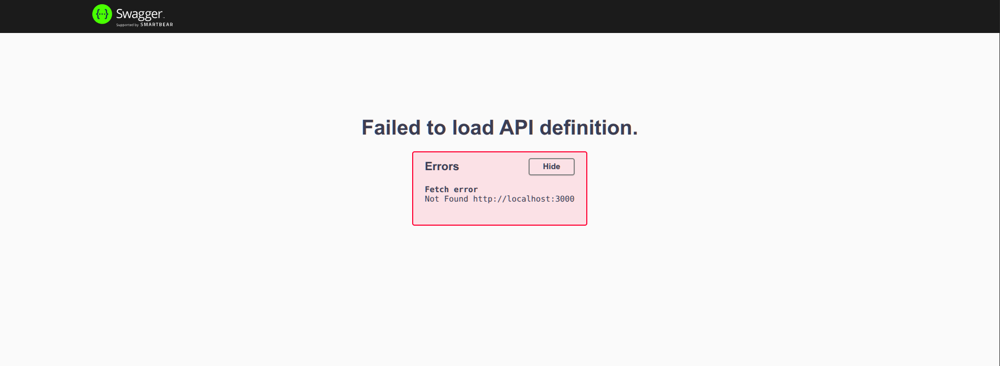

# Fazendo documentações de APIs Express com Swagger UI

🧱 1. Instale a biblioteca

Baixe a biblioteca Swagger UI Express:

```
npm install swagger-ui-express
```

### 📄 2. Crie o arquivo `swagger.json` na raiz do projeto

Crie na raiz do projeto um arquivo chamado `swagger.json` ou `swagger.yaml` e coloque uma chave vazia em seu conteúdo:

```json
swagger.json
{}
```

### 📦 3. Importe e configure o Swagger UI no `server.js`

```js
const express = require("express");
const app = express();

const swaggerUi = require("swagger-ui-express"); // CommonJS
// ou
// import swaggerUi from "swagger-ui-express"; // ES6
```

Adicione o middleware do Swagger:

```js
app.use("api-docs", swaggerUi.serve, swaggerUi.setup(require("./swagger")));

// Ou para melhor legibilidade:
// const swaggerDocs = require("./swagger.json");
// app.use("api-docs", swaggerUi.serve, swaggerUi.setup(swaggerDocs));
```

Visite [_http://localhost:3000/api-docs_](http://localhost:3000/api-docs) e verá algo próximo a isso:

<p align="center">
    
</p>

(... conteúdo continua ...)
